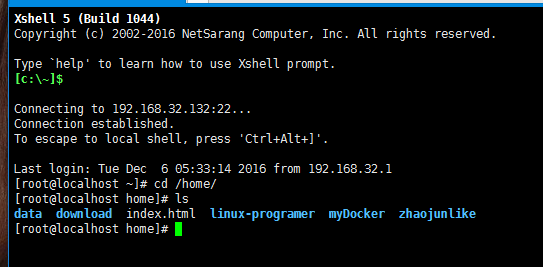
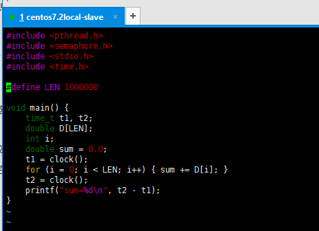
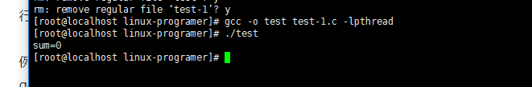
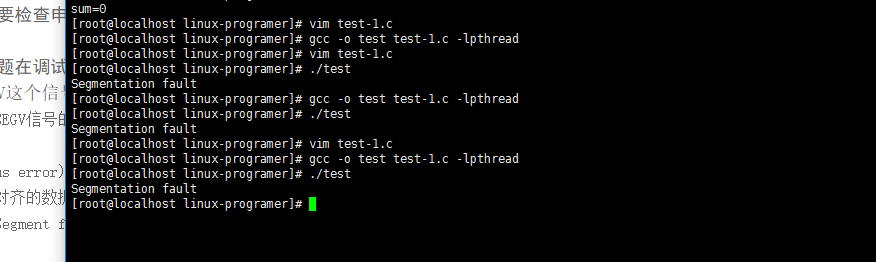
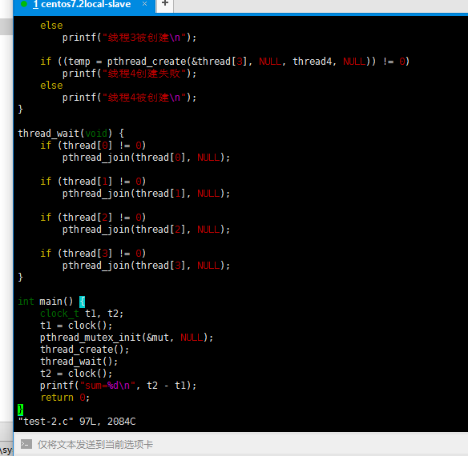
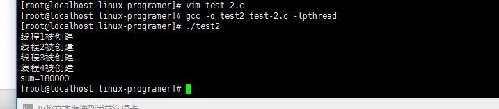
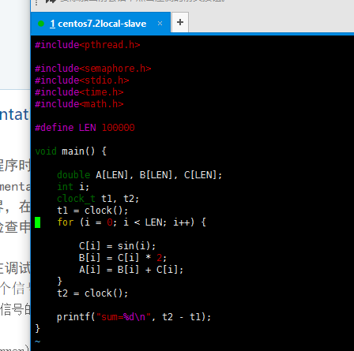
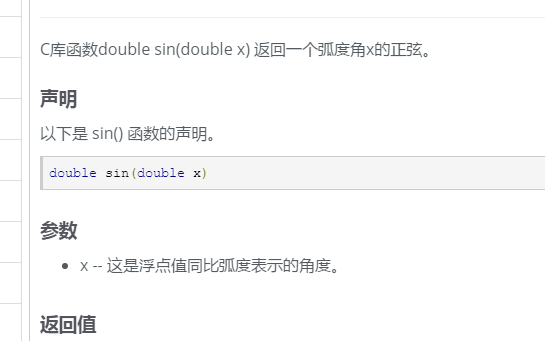

#实验
1、设一个double型的一维数组，数组长度是1,000,000，计算全数组部元素的和。 要求：1) 编制一个串行程序，仅有一个主线程完成上述计算。2）编制一个多线程程序，除主线程外，派生四个子线程完成上述计算。 分别获得以上两个程序的计算时间，对比分析。 
2、定义以下三个数组：
     	#define LEN 100000;       
Double A[LEN], B[LEN], C[LEN];     
for (i=0; i++;i<LEN)  
{          
C[i]=sin(i);       B[i]=C[i]*2;        A[i]=B[i]+C[i]  
}  
分别编制一段串行程序和一段多线程程序(包括四个线程)，执行上述循环体，比较其执行所花费的时间。

提示：clock()是C/C++中的计时函数， 与其相关的数据类型是clock_t，通过clock()可以获得当前的系统时间。

>###编译环境linux centos7.2 gcc
>
>###源代码
>
>
>编译
>```
>#gcc -o test test-1.c
>```
>运行
>```
>./指定当前文件目录
>#./test
>```


>编译指定信号量,运行的时候结果是0，可能是因为我电脑确实太快了
>


>然后我修改了一下len的长度，好像是数组越界了
>


##02实验

源码



编译，运行



##03实验

源码


编译运行

好像找不到math函数中得sin了,是编译时候的错误


我查了一下关于math.h中的c函数库文档[链接如下](http://www.tutorialspoint.com/c_standard_library/math_h.htm)



[解决方案](http://blog.csdn.net/odaynot/article/details/7995965)

Copy自小明同学的思考
```
明明是包含了math.h头文件的，怎么还显示sin没有定义呢？
原来，gcc的sin函数是定义在libm.so里面了。
用-l选项定义指定的路径。不填写的话默认是/lib和/usr/lib内。
因为linux下所有的函数库都是以lib开头的。所以除去头和尾，那么m就是代表libm.so
（m是库名，libm.so是库文件名）
在使用“ -l”参数时，通常的习惯是除去“lib”函数库头和后面的版本号，使用库名和参数“-l”连接，形成“-lm”。于是，我们需要在gcc找不到库时，可是使用“-l”直接给定库名。
（再补充一下：如果库不在默认路径的话，用“-L”选项即可添加路径,gcc sin.c -lm -o sin等价于gcc  sin.c -lm -L/lib -L/usr/lib -o sin）
网上都说libm.so在/lib或是/usr/lib下。在我的环境下（ubuntu12.04）也成功编译了。
但是进入目录（/lib和/usr/lib搜索却没有找到libm.so不知为何）
```


```
这样才会编译成功
#gcc -o test4 test-4.c -lpthread -lm
```


##总结
linux下的编程感觉不是很复杂，但是问题会有一大堆，原理性的东西很重要。